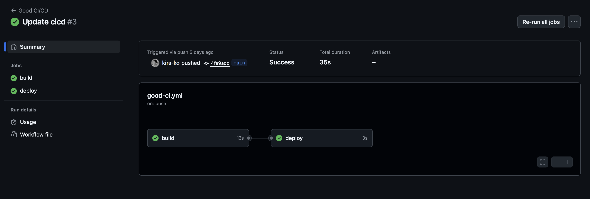

# Лабораторная работа №3


## Плохой CI/CD файл
```
stages:
  - build
  - test
  - deploy

variables:
  DOCKER_TAG: "latest"

.build_template: &build_template
  stage: build
  script:
    - echo "Building application..."
    - docker build -t myapp:$DOCKER_TAG .
    - docker save myapp:$DOCKER_TAG > myapp.tar
  artifacts:
    paths:
      - myapp.tar
    expire_in: 1 week

build_job:
  <<: *build_template

test_job:
  stage: test
  script:
    - docker load < myapp.tar
    - docker run myapp:$DOCKER_TAG npm test
    - echo "Tests passed!"
  needs: ["build_job"]

deploy_to_production:
  stage: deploy
  script:
    - echo "Deploying to production..."
    - scp myapp.tar user@production-server:/tmp/
    - ssh user@production-server "docker load < /tmp/myapp.tar && docker run -d myapp:$DOCKER_TAG"
  when: always
  only:
    - main
```

## "Хороший" CI/CD файл
```
stages:
  - build
  - test
  - deploy

.default_rules: &default_rules
  rules:
    - if: $CI_COMMIT_BRANCH == $CI_DEFAULT_BRANCH
      when: on_success
    - if: $CI_PIPELINE_SOURCE == "merge_request_event"
      when: on_success
    - when: manual

.docker_config: &docker_config
  image: docker:20.10
  services:
    - docker:20.10-dind
  variables:
    DOCKER_HOST: tcp://docker:2375
    DOCKER_TLS_CERTDIR: ""
  before_script:
    - docker login -u "$CI_REGISTRY_USER" -p "$CI_REGISTRY_PASSWORD" $CI_REGISTRY

build:
  stage: build
  <<: *docker_config
  <<: *default_rules
  variables:
    IMAGE_TAG: "$CI_REGISTRY_IMAGE:$CI_COMMIT_SHORT_SHA"
  script:
    - docker build --pull -t $IMAGE_TAG .
    - docker push $IMAGE_TAG

test:
  stage: test
  image: node:18-alpine
  <<: *default_rules
  needs: ["build"]
  script:
    - npm ci
    - npm test
  artifacts:
    paths:
      - coverage/
    expire_in: 7 days

deploy-staging:
  stage: deploy
  image: alpine:latest
  <<: *default_rules
  needs: ["test"]
  environment:
    name: staging
    url: https://staging.example.com
  only:
    - main
    - develop
  script:
    - echo "Deploying $CI_REGISTRY_IMAGE:$CI_COMMIT_SHORT_SHA to staging"
    - apk add --no-cache curl
    - |
      curl -X POST $DEPLOY_WEBHOOK_STAGING \
        -H "Authorization: Bearer $DEPLOY_TOKEN" \
        -H "Content-Type: application/json" \
        -d "{\"image\": \"$CI_REGISTRY_IMAGE:$CI_COMMIT_SHORT_SHA\"}"

deploy-production:
  stage: deploy
  image: alpine:latest
  environment:
    name: production
    url: https://example.com
  rules:
    - if: $CI_COMMIT_BRANCH == $CI_DEFAULT_BRANCH
      when: manual
  needs: ["deploy-staging"]
  script:
    - echo "Deploying $CI_REGISTRY_IMAGE:$CI_COMMIT_SHORT_SHA to production"
    - apk add --no-cache curl
    - |
      curl -X POST $DEPLOY_WEBHOOK_PROD \
        -H "Authorization: Bearer $PRODUCTION_DEPLOY_TOKEN" \
        -H "Content-Type: application/json" \
        -d "{\"image\": \"$CI_REGISTRY_IMAGE:$CI_COMMIT_SHORT_SHA\"}"
```

## Использование статического тега latest для Docker образов

**Проблема** Тег latest не обеспечивает впоспроизводимость и при смени версий используемых инструментов программа может сломаться
'''
variables:
  DOCKER_TAG: "latest"
 '''
**Решение** Используется уникальный тег на основе хэша коммита. Нет конфликта версий

```
variables:
  DOCKER_IMAGE: "$CI_REGISTRY_IMAGE:$CI_COMMIT_SHORT_SHA"
  DOCKER_IMAGE_LATEST: "$CI_REGISTRY_IMAGE:latest"
```

### 2. Нет контроля окружений и деплой в production при любых условиях

**Проблема** Всегда выполняются действия даже, если предыдущие шаги провалились. Деплой в production происходит автоматически без промежуточной стадии.

'''
deploy_to_production:
  when: always
  only:
    - main
'''

**Решение** Добавлена среда staging для предварительного тестирования. Добавление в production требует ручного подтверждения. Так мы получаем больше контроля над процессами развертывания, меньше рисков при деплое нестабильного кода.

``` 
deploy_to_staging:
  environment:
    name: staging
  needs: ["security_scan", "integration_tests"]
  
deploy_to_production:
  rules:
    - if: $CI_COMMIT_BRANCH == "main"
      when: manual
      allow_failure: false
  needs: ["deploy_to_staging"]
```


### 3.  Небезопасное копирование файлов

**Проблема** Используется прямой SSH/SCP с захардкоженными учетными данными. Также нет сканирования на уязвимости.

'''
deploy_to_production:
  script:
    - scp myapp.tar user@production-server:/tmp/
    - ssh user@production-server "docker load < /tmp/myapp.tar && docker run -d myapp:$DOCKER_TAG"
'''
**Решение** Добавлен stage для проверки на уязвимости. Еще используются переменные окружения для секретов, что делает хранение данных безопаснее. И деплой через API/webhook вместо SSH.

```
security_scan:
  stage: security_scan
  script:
    - trivy image --exit-code 1 --severity HIGH,CRITICAL $DOCKER_IMAGE

deploy_to_production:
  script:
    - |
      curl -X POST \
        -H "Authorization: Bearer $PRODUCTION_DEPLOY_TOKEN" \
        -d "{\"image\": \"$DOCKER_IMAGE\"}" \
        $PRODUCTION_DEPLOY_WEBHOOK_URL
```


##Деплой



