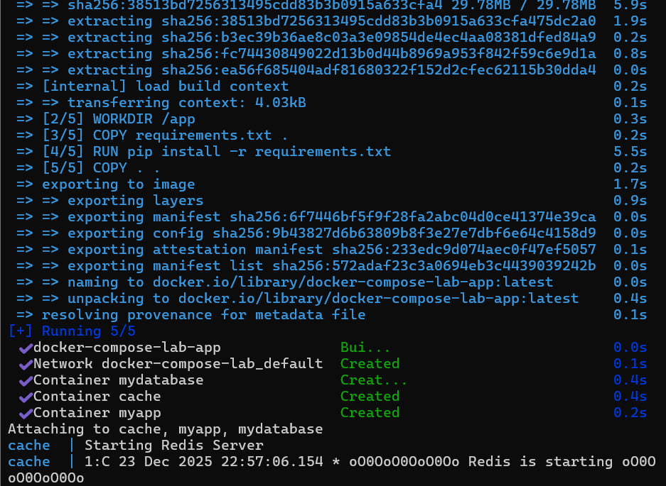
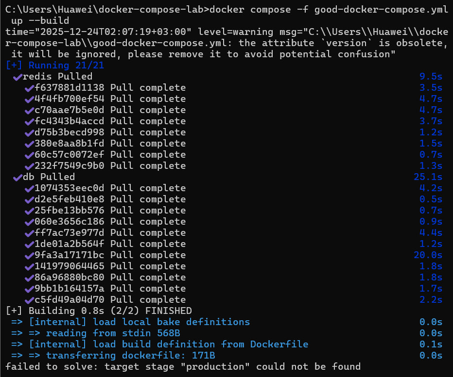
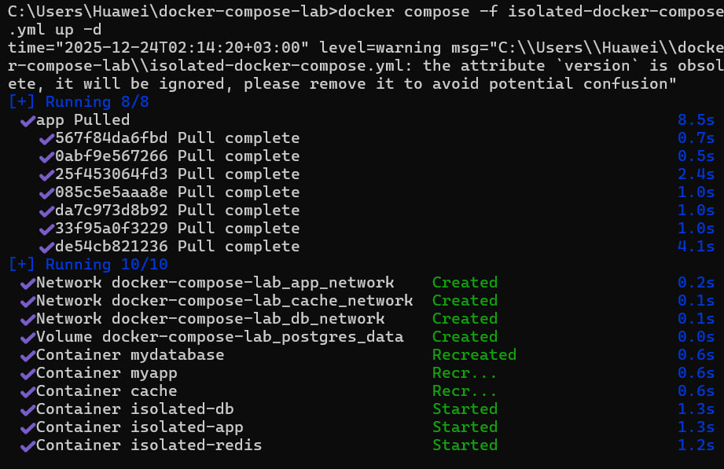

# Лабораторная работа №2 со звездочкой

# Ход работы
## 1. Плохой docker compose файл(bad-docker-compose.yml)
```bash
version: '3'
services:
  db:
    image: postgres:latest
    container_name: mydatabase
    environment:
      POSTGRES_PASSWORD: admin123
      POSTGRES_USER: admin
      POSTGRES_DB: production
    ports:
      - "5432:5432"
    volumes:
      - /data:/var/lib/postgresql/data
    restart: always
  
  app:
    build: .
    container_name: myapp
    depends_on:
      - db
    ports:
      - "80:80"
      - "443:443"
    environment:
      DB_HOST: db
      DB_PASSWORD: admin123
    command: python app.py
    restart: always
  
  redis:
    image: redis:latest
    container_name: cache
    ports:
      - "6379:6379"
```
## 2. Хороший docker compose файл (good-docker-compose.yml)
```bash
version: '3.8'
services:
  db:
    image: postgres:15-alpine
    container_name: app-database-${APP_ENV:-development}
    environment:
      POSTGRES_PASSWORD: ${DB_PASSWORD:-secure_password}
      POSTGRES_USER: ${DB_USER:-app_user}
      POSTGRES_DB: ${DB_NAME:-app_db}
    ports:
      - "${DB_PORT:-5432}:5432"
    volumes:
      - postgres_data:/var/lib/postgresql/data
    restart: unless-stopped
    healthcheck:
      test: ["CMD-SHELL", "pg_isready -U ${DB_USER:-app_user}"]
      interval: 10s
      timeout: 5s
      retries: 5
  
  app:
    build:
      context: .
      dockerfile: Dockerfile
      target: ${BUILD_TARGET:-production}
    container_name: app-web-${APP_ENV:-development}
    depends_on:
      db:
        condition: service_healthy
    ports:
      - "${APP_PORT:-8080}:80"
    environment:
      DB_HOST: db
      DB_PASSWORD: ${DB_PASSWORD:-secure_password}
      DB_NAME: ${DB_NAME:-app_db}
      DB_USER: ${DB_USER:-app_user}
    env_file:
      - .env
    restart: unless-stopped
  
  redis:
    image: redis:7-alpine
    container_name: app-cache-${APP_ENV:-development}
    command: redis-server --requirepass ${REDIS_PASSWORD:-redis_pass}
    volumes:
      - redis_data:/data
    restart: unless-stopped

volumes:
  postgres_data:
    driver: local
  redis_data:
    driver: local
```
## 3. Плохие практики в bad-docker-compose.yml
•	Использование тега :latest для образов.
Все сервисы используют тег :latest, что приводит к непредсказуемому поведению при обновлениях и что-то может сломаться.
Как исправлено в хорошем файле:
Теперь используются конкретные версии (postgres:15-alpine, redis:7-alpine). Гарантирована воспроизводимость и контроль над версиями.

•	Хранение чувствительных файлов прямо в compose-файле
Пароли и конфигурация захардкожены в YAML. То есть пароли попадают в системы контроля версий и становится невозможно использовать разные конфигурации для разных сред.
Как исправлено в хорошем файле:
Использование переменных окружения через ${VARIABLE}. Чувствительные данные перенесены в .env файл. Теперь безопасность данных и гобкость конфигурации намного выше.

•	Использование bind mounts для данных баз данных и отсутствие healthcheck.
Отсутствует проверка готовности сервисов. Зависимость depends_on без проверки состояние и Bind mount на хост-систему.
Как исправлено в хорошем файле:
Используются named volumes вместо Bind mounts. Для базы данных добавлен healthcheck и условие condition: service_healthy в depends_on.
## 4. Запуск
Плохой Docker Compose


Хороший Docker Compose


## 5. Изолированные контейнеры
Мы изолируем каждый сервис, помещая каждый из них в отдельный Docker network. То есть каждый сервис находится в своей собственной сети (dp_network, app_network, cache_network). Использован драйвер bridge для создания изолированных сетей. Сами контейнеры видят только те сети, к которым они явно подключены.

### Изолированный Docker Compose файл
```bash
version: '3.8'
services:
  db:
    image: postgres:15-alpine
    container_name: isolated-db
    environment:
      POSTGRES_PASSWORD: isolated_pass
      POSTGRES_DB: isolated_db
    networks:
      - db_network
    volumes:
      - postgres_data:/var/lib/postgresql/data
    restart: unless-stopped
  
  app:
    image: nginx:alpine
    container_name: isolated-app
    ports:
      - "8080:80"
    networks:
      - app_network
    volumes:
      - ./html:/usr/share/nginx/html
    restart: unless-stopped
  
  redis:
    image: redis:7-alpine
    container_name: isolated-redis
    networks:
      - cache_network
    command: redis-server --requirepass redis_pass
    restart: unless-stopped

networks:
  db_network:
    driver: bridge
    internal: false
  app_network:
    driver: bridge
    internal: false
  cache_network:
    driver: bridge
    internal: false

volumes:
  postgres_data:
    driver: local
```

Запуск изолированного docker compose

 

# Вывод

Были показаны файлы с хорошими и плохими практиками при работе c Docker compose. А исправление ошибок помогло сделать работу сервисов безопаснее, обеспечить постоянную воспроизводимость сборки, а архитектуру чище и изолированнее.

